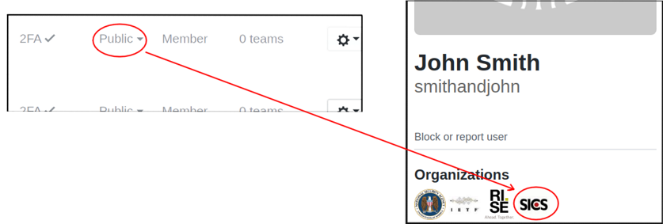

Who are we?
===========

Swedish Institute of Computer Science (`SICS <https://en.wikipedia.org/wiki/Swedish_Institute_of_Computer_Science>`_) was a leading research institute for applied information and communication technology in Sweden. SICS employed over 200 researchers, most with a PhD degree.

In 2017 SICS joined `RISE <https://www.ri.se/>`_ (Research Institutes of Sweden, an independent state-owned research institute with ~3000 employees) and as such no longer exists as an institution.

Why are we here?
================

SICS employees were involved in a number of important software projects such as Contiki, lwIP, uIP and Nemesis. This GitHub organization aims to gather former employees/students and their projects in one place - a developer alumni page if you like.

If you are looking for specific repositories, please visit our `members <https://github.com/orgs/SICS/people>`_ own pages. The organization itself contains no repositories (excluding this README). 

How can I join?
===============

If you are a former SICS employee/student and would like to be added, removed or have questions please contact the author of this document (preferably via company email). Joining this organization is free and should not affect your current GitHub plan. 

Note that to see the SICS badge you must set your SICS membership visibility to public (from the People tab):

